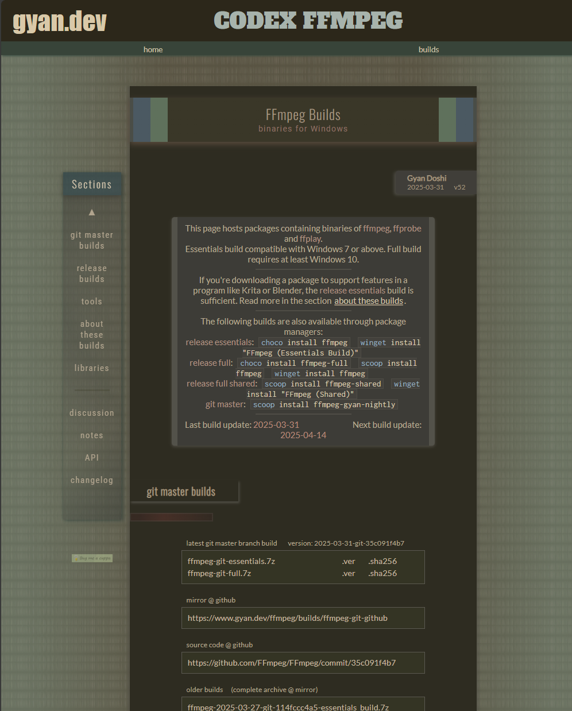
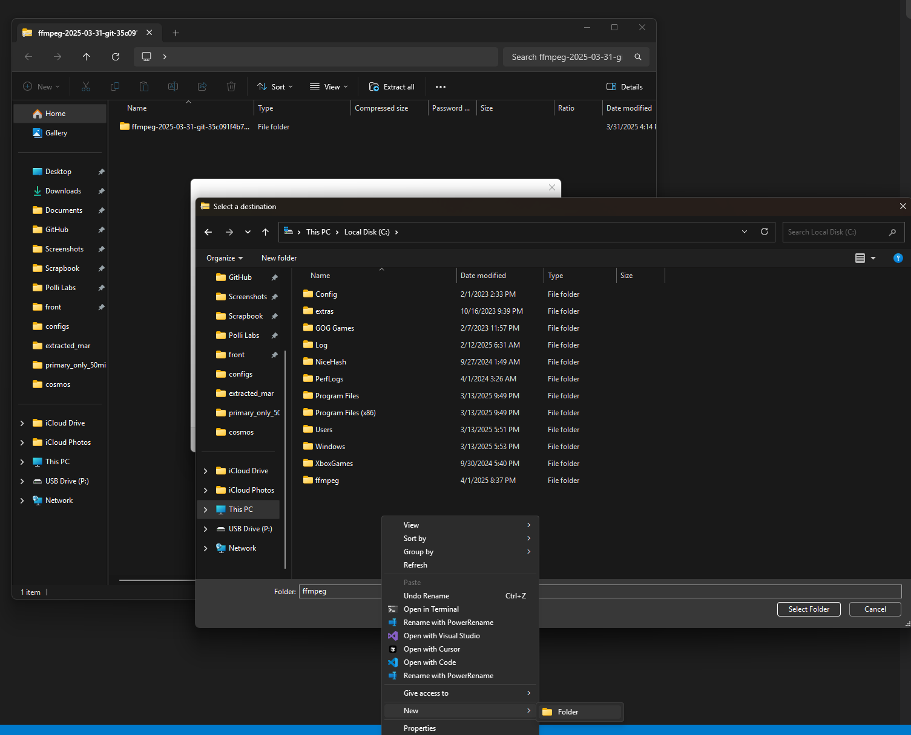
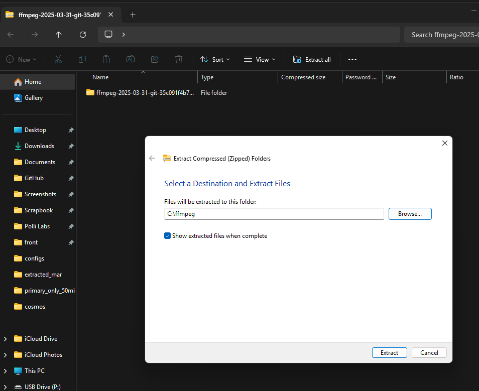
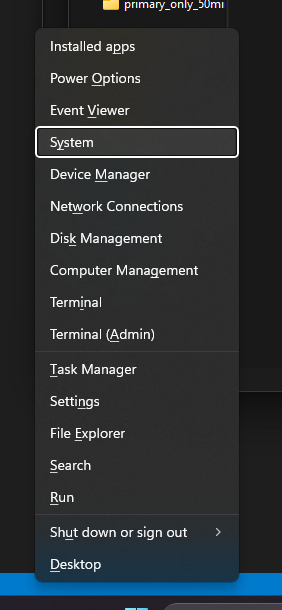
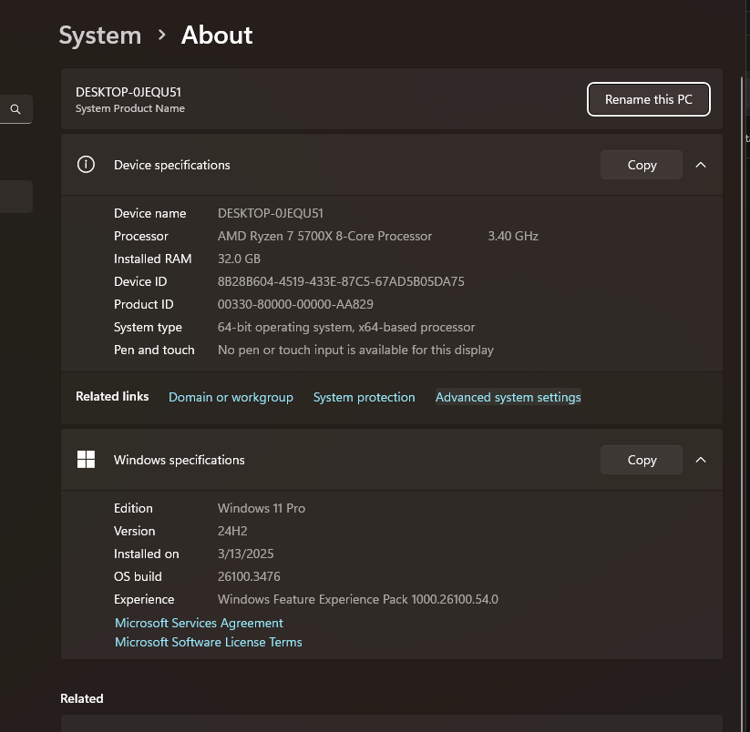
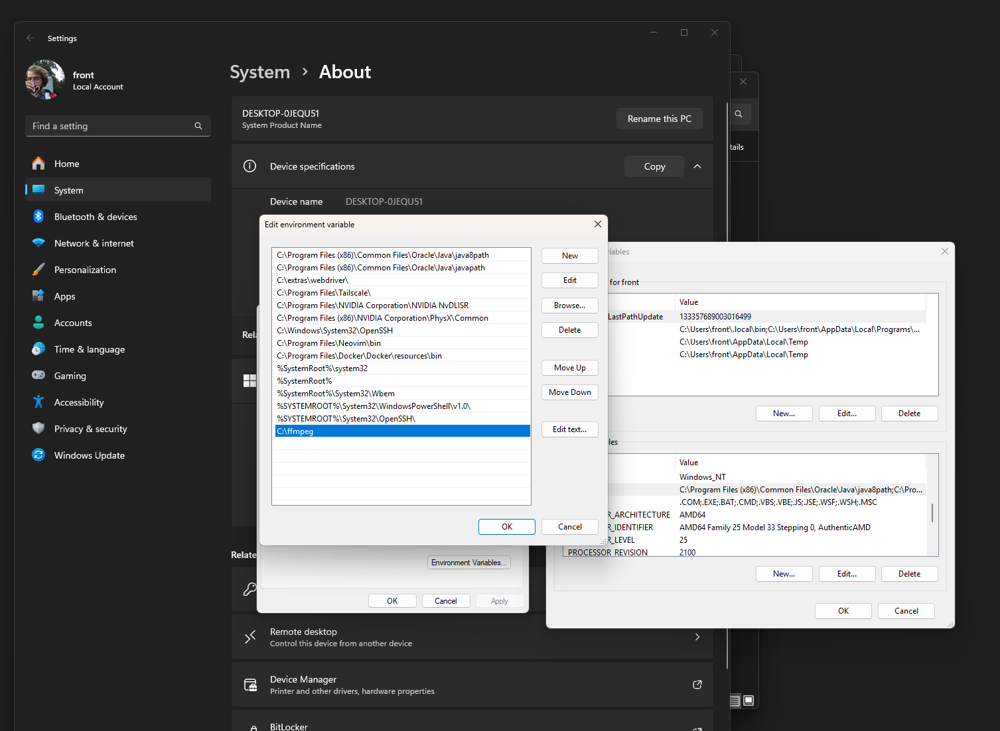

# COSM C360 Tools - User Guide

This user guide provides comprehensive, step-by-step instructions for using COSM C360 Tools to convert specialized COSM camera footage into standard MP4 video files that can be played on any device. This guide is designed for all users, including those with no technical experience.

## 📋 Quick Start Summary

1.  Install **Python 3.10+** (detailed instructions below).
2.  Install **FFmpeg** (detailed instructions below - **Windows users follow carefully!**).
3.  Download the COSM C360 Tools code (e.g., using GitHub Desktop or downloading the ZIP).
4.  Open Terminal (macOS/Linux) or Command Prompt (Windows).
5.  Navigate (`cd`) into the `cosm-c360-tools` folder you downloaded.
6.  Run `pip install -r requirements.txt` (or `pip3` on some systems) to install needed software packages.
7.  Run `python cosmos.py --interactive` (or `python3`) to start the interactive mode.
8.  Follow the on-screen prompts to select your camera footage and convert it.

## 🛠️ Detailed Installation Guide

This tool requires two other free software programs to be installed first: **Python** and **FFmpeg**.

### Step 1: Install Python (Version 3.10 or higher)

Python is the programming language the tool is written in.

#### Windows:

1.  Go to the official Python download page: [https://www.python.org/downloads/](https://www.python.org/downloads/)
2.  Click the button to download the latest Python version for Windows.
3.  Run the installer file (e.g., `python-3.1x.x-amd64.exe`).
4.  **VERY IMPORTANT**: On the first screen of the installer, **check the box** at the bottom that says "**Add python.exe to PATH**". This makes Python easier to use later.
    
5.  Click "**Install Now**". Wait for the installation to complete.
6.  **Verify Installation:** Open Command Prompt (search for `cmd` in the Windows Start menu). Type `python --version` and press Enter. You should see a version number like `Python 3.10.x` or higher. If you see an error, try restarting your computer and checking again.

#### macOS:

1.  **Install Homebrew (if you don't have it):** Homebrew is a popular package manager for macOS. Open the **Terminal** app (Applications > Utilities > Terminal) and paste this command, then press Enter:
    ```bash
    /bin/bash -c "$(curl -fsSL https://raw.githubusercontent.com/Homebrew/install/HEAD/install.sh)"
    ```
    Follow any on-screen instructions (you might need to enter your password).
2.  **Install Python using Homebrew:** In the Terminal, run:
    ```bash
    brew install python
    ```
3.  **Verify Installation:** Close and reopen Terminal. Type `python3 --version` and press Enter. You should see `Python 3.10.x` or higher.

#### Linux (Ubuntu/Debian):

1.  Open your Terminal and run these commands:
    ```bash
    sudo apt update
    sudo apt install python3 python3-pip python3-venv
    ```
2.  **Verify Installation:** Type `python3 --version` and press Enter. You should see `Python 3.10.x` or higher.

### Step 2: Install FFmpeg

FFmpeg is a powerful program that handles the actual video conversion.

#### Windows (Follow Carefully):

This involves downloading, extracting, and telling Windows where to find the program (adding it to the "PATH").

**a. Download FFmpeg:**
1.  Go to the FFmpeg Builds page: [https://www.gyan.dev/ffmpeg/builds/](https://www.gyan.dev/ffmpeg/builds/)
2.  Scroll down slightly to the "release builds" section.
3.  Find the link ending in `ffmpeg-release-essentials.zip`. Click this link to download the file.
    

**b. Extract the Downloaded File:**
1.  Open your `Downloads` folder and find the `ffmpeg-release-essentials.zip` file.
2.  Right-click on the ZIP file and choose "**Extract All...**".
3.  A window will pop up. **IMPORTANT:** Click "**Browse...**", navigate to your main `C:` drive in the left panel, and click "**Make New Folder**" (or right-click -> New -> Folder). Name this new folder exactly `ffmpeg`. Click on the `ffmpeg` folder you just created so it's selected, then click "**Select Folder**". The extraction path box should now say `C:\ffmpeg`.
    
4.  Make sure the "Show extracted files when complete" box is checked.
5.  Click "**Extract**". A new folder window `C:\ffmpeg` should open.

**IMPORTANT - Understanding the Folder Structure:**
After extraction, you'll see this folder structure:
```
C:\ffmpeg\                         <- The folder you created
    └── ffmpeg-X.Y.Z-essentials_build\  <- Version-specific folder (e.g., ffmpeg-7.1.1-essentials_build)
        ├── bin\                   <- THIS is the folder containing ffmpeg.exe
        ├── doc\
        └── presets\
```
The exact version number (X.Y.Z) in the folder name will depend on when you downloaded FFmpeg. **Take note of your actual folder name - you'll need it in the next step!**

**c. Tell Windows Where to Find FFmpeg (Adding to PATH):**
This step makes `ffmpeg` available from any Command Prompt window.

*   **(Highly Recommended) Watch Video Guide:** [Watch how to add FFmpeg to the PATH (Click Here)](assets/win_ffmpeg_add_path_video.mp4)
    *(Note: You may need to right-click and "Save Link As..." or open the video in a player)*

*   **Step-by-Step Instructions (if you prefer text/images):**
    1.  Right-click the Windows Start Menu button (bottom-left corner) and click on "**System**".
        
    2.  In the System window, look on the right side (you might need to scroll down) for "**Advanced system settings**" and click it.
        
        *(Alternative: Press the Windows key, type `View advanced system settings`, and click the matching result.)*
    3.  A "System Properties" window appears. Click the "**Environment Variables...**" button near the bottom.
        
    4.  In the new "Environment Variables" window, look at the **bottom section** labeled "**System variables**". Find "**Path**" in the list, click it once, then click "**Edit...**".
        
    5.  In the "Edit environment variable" window, click the "**New**" button.
    6.  A new blank line appears. Type the **FULL** path to your `bin` folder. It will look like this, but with your actual version number:
        ```
        C:\ffmpeg\ffmpeg-X.Y.Z-essentials_build\bin
        ```
        For example, if you downloaded version 7.1.1, you would type:
        ```
        C:\ffmpeg\ffmpeg-7.1.1-essentials_build\bin
        ```
        
    7.  Click "**OK**" on this "Edit..." window.
    8.  Click "**OK**" on the "Environment Variables" window.
    9.  Click "**OK**" on the "System Properties" window.

**d. Verify FFmpeg Installation:**
1.  **IMPORTANT:** Close any Command Prompt windows you have open. Open a **new** Command Prompt (search `cmd` in Start Menu).
2.  Type `ffmpeg -version` and press Enter.
3.  You should see several lines of text starting with `ffmpeg version ...`. This means it's working!
    
    If you see an error like "'ffmpeg' is not recognized...", here are the most common fixes:
    - Double-check that you used the **complete** path including your version number (not just `C:\ffmpeg\bin`)
    - Make sure you clicked "OK" on all three windows when setting the PATH
    - Try restarting your computer
    - If it still doesn't work, open Command Prompt and type `echo %PATH%`. Look for your FFmpeg path in the output.

#### macOS:

1.  Using Homebrew (Terminal):
    ```bash
    brew install ffmpeg
    ```
2.  Verify (in a new Terminal window):
    ```bash
    ffmpeg -version
    ```
    You should see version information.

#### Linux (Ubuntu/Debian):

1.  Using Terminal:
    ```bash
    sudo apt update
    sudo apt install ffmpeg
    ```
2.  Verify (in a new Terminal window):
    ```bash
    ffmpeg -version
    ```
    You should see version information.

### Step 3: Download and Set Up COSM C360 Tools

1.  **Get the Tool Code:**
    *   **Option A (Easier Updates):** Use GitHub Desktop (install from [desktop.github.com](https://desktop.github.com/)). Go to `File` > `Clone Repository`, select the `URL` tab, enter `https://github.com/frontierkodiak/cosm-c360-tools.git`, choose a location (like `Documents\GitHub\cosm-c360-tools`), and click `Clone`.
    *   **Option B (Simple Download):** Visit the [GitHub repository](https://github.com/frontierkodiak/cosm-c360-tools). Click the green "<> Code" button, then "Download ZIP". Extract the downloaded ZIP file to a memorable location (e.g., `Documents\cosm-c360-tools`).
2.  **Install Python Dependencies:** These are extra software packages Python needs to run the tool.
    *   Open Terminal (macOS/Linux) or Command Prompt (Windows).
    *   Navigate **into** the folder where you put the tool code using the `cd` command:
        ```bash
        # Example on Windows (use your actual path)
        cd C:\Users\YourName\Documents\GitHub\cosm-c360-tools

        # Example on macOS/Linux (use your actual path)
        cd ~/Documents/GitHub/cosm-c360-tools
        ```
    *   Run this command to install the dependencies:
        ```bash
        pip install -r requirements.txt
        ```
        *(If `pip` gives an error, try `pip3 install -r requirements.txt`)*

## 💻 Using the Tool

Now that Python, FFmpeg, and the tool's dependencies are installed, you can convert your videos!

### Interactive Mode (Recommended)

This mode asks you simple questions to guide the conversion process.

1.  **Start the Tool:**
    *   Open Terminal (macOS/Linux) or Command Prompt (Windows).
    *   Navigate (`cd`) into the `cosm-c360-tools` directory if you're not already there.
    *   Run:
        ```bash
        python cosmos.py --interactive
        ```
        *(Use `python3` if `python` doesn't work)*
2.  **Follow Prompts:** The tool will ask for:
    *   `Load existing configuration?`: Type `N` (for No) the first time.
    *   `Job name:`: Enter a short name for this conversion job (e.g., `test_run_1`). Press Enter.
    *   `Input directory containing raw segments:`: Type or paste the full path to the folder holding your COSM camera files (e.g., `C:\Camera_Footage\Batch_1`). Press Enter.
    *   `Output base directory:`: Type or paste the full path to an **empty** folder where you want the final MP4 videos saved (e.g., `C:\Converted_Videos`). The tool will create a subfolder using your Job Name inside this directory. Press Enter.
    *   `Select log level:`: Use arrow keys to select `INFO` (or `DEBUG` if troubleshooting). Press Enter.
    *   `Select output resolution:`: Use arrow keys to choose video size (e.g., `4k` or `1080p`). Press Enter.
    *   `Select quality mode:`: Use arrow keys (`balanced` is usually good). Press Enter.
    *   `Enable low memory mode?`: Type `Y` (for Yes) if you have 16GB RAM or less, or if processing very large (8K+) files. Otherwise, type `N`. Press Enter.
    *   `Set custom CRF value?`: Type `N` unless you have specific quality needs. Press Enter.
3.  **Review Settings:** The tool shows your choices. Check them carefully.
4.  `Proceed with these settings?`: Type `Y` and press Enter to start.
5.  `Save this configuration?`: Type `Y` if you want to easily reuse these settings later (give it a name). Type `N` if not. Press Enter.
6.  **Wait:** The tool will now process the video clips. This can take minutes or hours depending on the footage length, your computer hardware, processing settings, and whether any accelerators are available on your ffmpeg installation.
7.  **Done!** Check your output folder for the finished MP4 files. There will also be a `job_info.txt` file summarizing the process.

*   **(Optional) Watch Video Guide:** [See how to activate your environment and enter the interactive mode on Windows (Click Here)](assets/win_tool_usage_video.mp4)
    *(Note: You may need to right-click and "Save Link As..." or open the video in a player)*

### Command Line Mode (Advanced)

Specify all options in one command (useful for scripting). See the [Command Reference](COMMAND_REFERENCE.md) for all options.

```bash
# Example:
python cosmos.py --input-dir C:\Camera_Footage\Batch_1 --output-dir C:\Converted_Videos --job-name MyJob --output-resolution 4k --quality-mode balanced
```

## ⚙️ Configuration Options Explained

### Output Resolution

| Resolution | Dimensions | Description                     |
| :--------- | :--------- | :------------------------------ |
| `original` | 9280×6300  | Full source size (very large) |
| `8k`       | 7680×4320  | Ultra HD (large files)          |
| `4k`       | 3840×2160  | Good balance (default)          |
| `1080p`    | 1920×1080  | Standard HD (smaller files)     |
| `720p`     | 1280×720  | Smallest size, good for sharing |

You can also use custom `WIDTHxHEIGHT` like `--output-resolution 1920x1080`.

### Processing Quality Modes

| Mode          | Quality  | Speed   | Memory Use | Recommended For                     |
| :------------ | :------- | :------ | :--------- | :---------------------------------- |
| `quality`     | Highest  | Slowest | High       | Final outputs, powerful computers |
| `balanced`    | Good     | Medium  | Medium     | Most users (default)              |
| `performance` | Lower    | Fast    | Medium     | Quick previews                    |
| `low_memory`  | Good     | Slow    | Low        | Systems with 8-16GB RAM           |
| `minimal`     | Lower    | Slowest | Lowest     | Systems with <8GB RAM             |

### Low Memory Mode (`--low-memory`)

*   **Strongly recommended** if you have 16GB of RAM or less, especially when processing 4K or higher resolutions.
*   Also helpful if processing seems to make your computer unresponsive.
*   Reduces the number of processing threads used, significantly lowering RAM usage but increasing processing time.
*   Enable this option *in addition* to potentially choosing the `low_memory` or `minimal` *quality* mode for maximum memory saving.

## 🔍 Troubleshooting Common Issues

### "python", "pip", or "ffmpeg" is not recognized...

*   **Did you install it?** Double-check Steps 1 & 2.
*   **(Windows)** Did you check "**Add Python to PATH**" during Python install? If not, reinstall Python and make sure to check the box.
*   **(Windows)** Did you correctly add `C:\ffmpeg\bin` to the **System** Path variable (not User)? See Step 2c.
*   **Did you open a *new* Terminal/Command Prompt?** Changes to PATH often require restarting the command window. Try restarting your computer as well.
*   **Try `python3` or `pip3` instead?** On macOS/Linux, these are often the correct commands.

### Out of Memory Errors / Computer Freezes

*   Enable **Low Memory Mode** in interactive prompts or add `--low-memory` to your command.
*   Select the `minimal` **Quality Mode**.
*   Choose a lower **Output Resolution** (e.g., `1080p`).
*   Close other programs (web browsers, games, etc.) while processing.

### Input Directory Problems / Missing Files

*   Ensure the path you provide is correct and leads directly to the folder containing the `0H`, `1H`... folders and the `.xml` manifest file.
*   Check that the folder structure matches the expected format (see [Input Structure](INPUT_STRUCTURE.md)).
*   Make sure the `.ts` video files and `meta.json` files are present inside the `0S`, `1S`, etc. folders.

### Output Directory Problems / Permission Errors

*   Ensure the path exists and you have permission to write files there.
*   Try creating a simple output path like `C:\CosmosOutput`.
*   Check if you have enough free disk space (10GB+ is a good start, more for large videos).

## 📱 Advanced Features

### Saving and Loading Configurations

*   If you use the same settings often, save them! In interactive mode, answer `Y` to "Save this configuration?". Give it a name (e.g., `4k_balanced`).
*   Next time, answer `Y` to "Load existing configuration?" and select your saved name.
*   You can also load using the command line: `python cosmos.py --config 4k_balanced` (no input/output needed if saved in config).

### Custom CRF Values (`--crf`)

*   For fine-tuning video quality vs. file size (advanced). Lower values (e.g., 18) mean higher quality/larger files. Higher values (e.g., 28) mean lower quality/smaller files. Usually not needed.

## 🆘 Getting Help

If you're stuck:

1.  **Run the Self-Test:** This checks your setup without processing videos. Navigate to the tool directory in Terminal/Command Prompt and run:
    ```bash
    python cosmos.py --self-test --input-dir C:\Path\To\Your\Input --output-dir C:\Path\To\Your\Output
    ```
    *(Replace paths with your actual input/output folders)*. Address any errors it reports.
2.  **Enable Detailed Logging:** Run your command again, adding `--log-level DEBUG --log-file debug.log`. This creates a `debug.log` file in the tool's folder with detailed information.
    ```bash
    python cosmos.py --interactive --log-level DEBUG --log-file debug.log
    ```
3.  **Contact Support:**
    *   Email [caleb@polli.ai](mailto:caleb@polli.ai)
    *   Include:
        *   What you were trying to do.
        *   The *exact* command you ran (if not using interactive mode).
        *   Any error messages you saw.
        *   Attach the `debug.log` file if you created one.
        *   Mention your Operating System (e.g., Windows 11, macOS Sonoma).